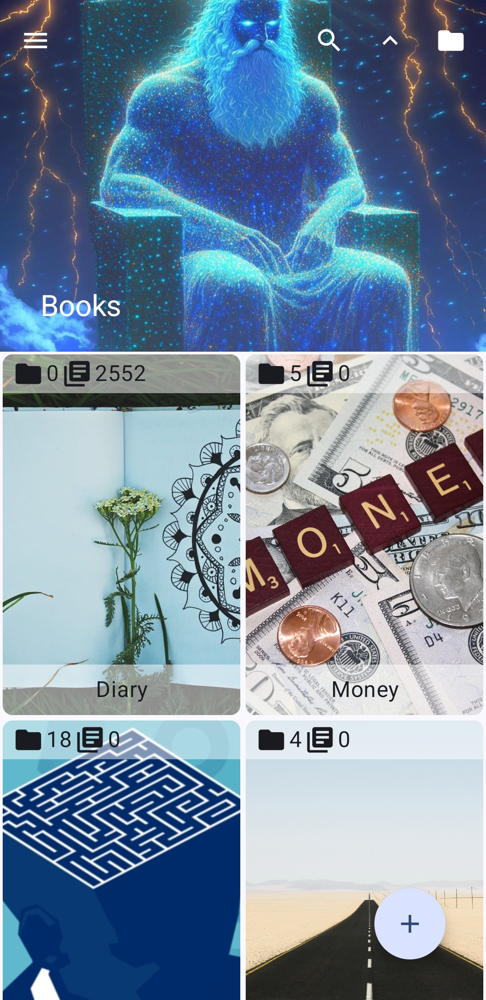
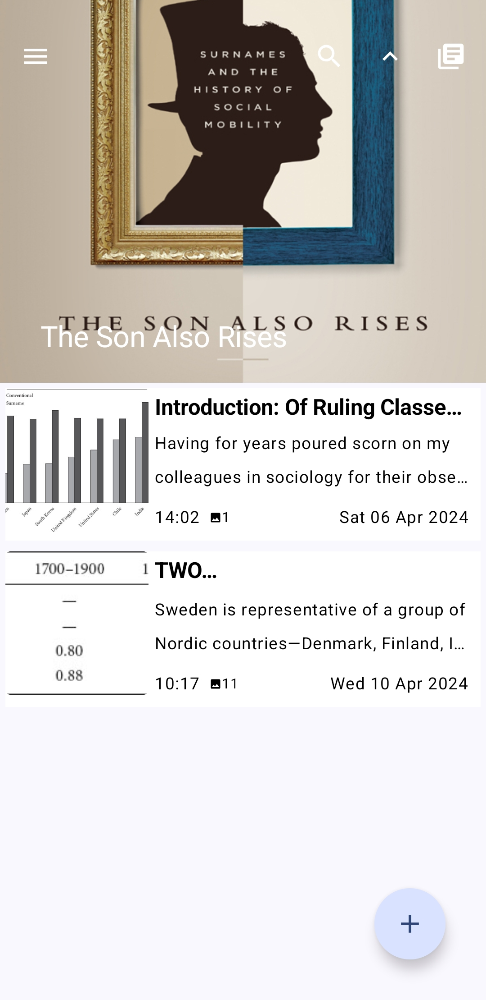
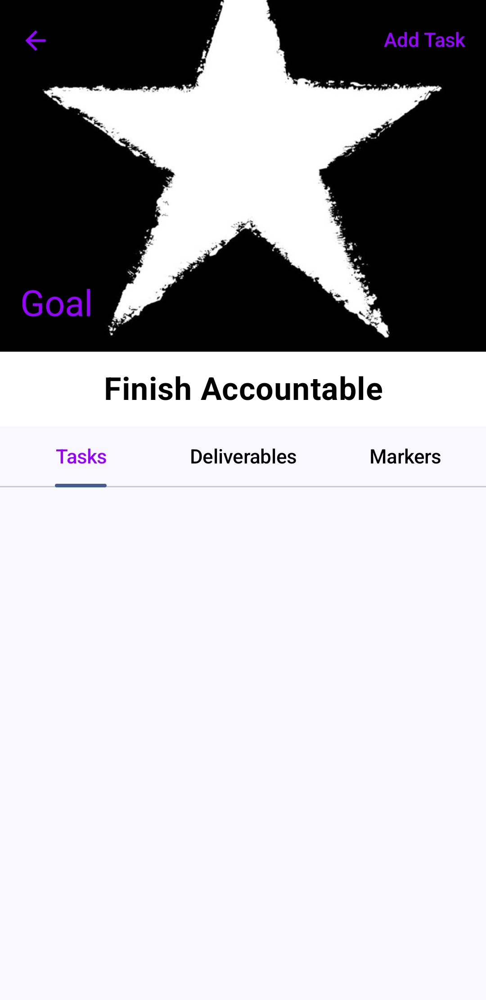
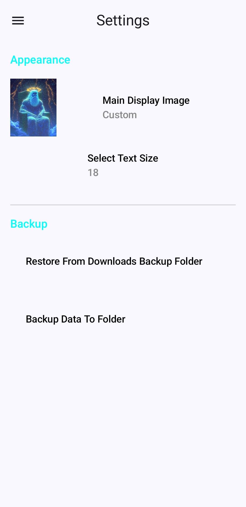

# 📱 Accountable

An Android application built with **Kotlin and Compose** that helps users keep track of their day to day activities, events, thoughts and stories.

---

## 🚀 Features

- ✅ Simple and intuitive UI
- 📊 Real-time data visualization
- 🔔 Notifications

---

## 📸 Screenshots

### Books Screen

*The main books dashboard where users can browse their books and scripts.*

### Scripts List Screen

*Inside a book/folder where the scripts belonging to the book are listed.*

### Script Screen

*An open script that displays text, images, videos, audios and documents.*

### Edit Goal Screen

*A form where the user enters information for a new goal.*

### Goal Screen

*The main goal dashboard where the user can enter tasks, deliverables and markers.*

### Settings Screen

*The settings screen where the user can customize the application.*

---